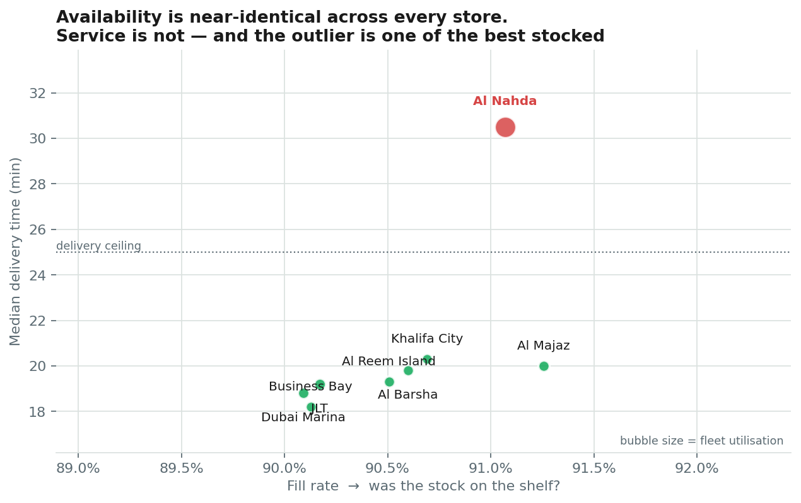
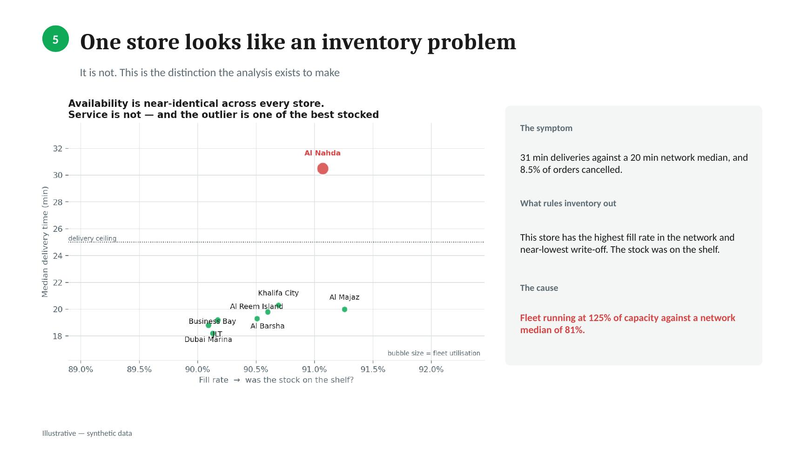
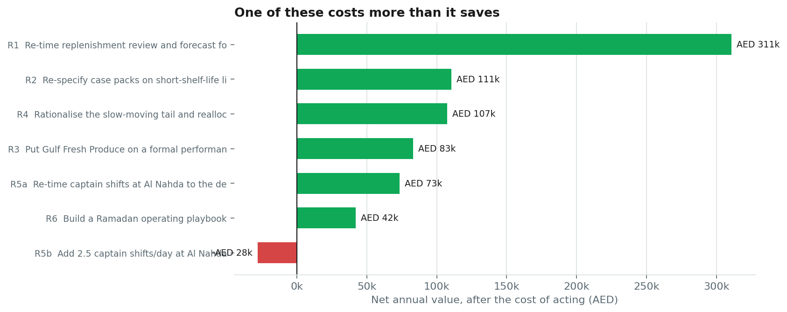
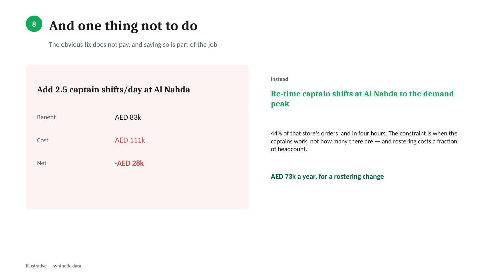
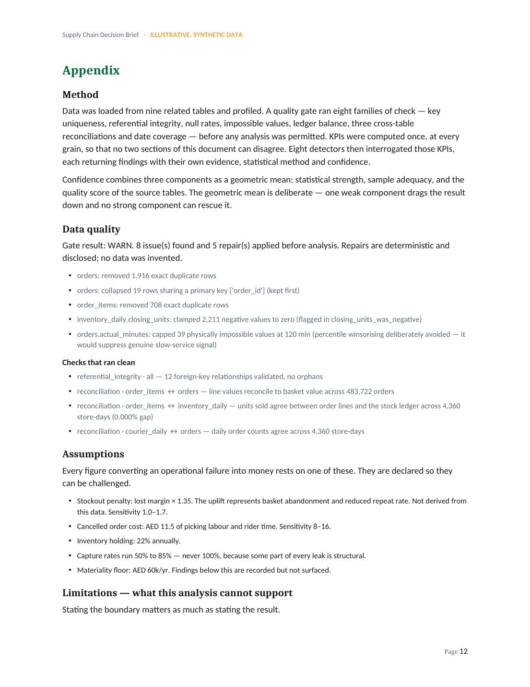

# Decision Brief Generator

**Turns raw operational data into an executive decision brief — quantified findings, root-cause analysis, and costed recommendations with named owners.**

> **Illustrative — synthetic data.** Everything here is generated by
> [`src/generate_dummy_data.py`](src/generate_dummy_data.py). No Careem data of any kind
> is used, and no figure in any output describes a real business. This is an independent
> demonstration of method, not affiliated with or endorsed by Careem.

---

## Links

| | |
|---|---|
| **Live dashboard** | https://misbahhamid-30.github.io/decision-brief-generator/ |
| **Full datasets** (Drive) | https://drive.google.com/drive/folders/1zZB-89sijqsABALomzSrZTa4O4vzpmNm?usp=sharing |
| **Sample data** — browse in-page | [`data/samples/`](data/samples/) |
| **Word brief** — supply chain | [`outputs/Decision-Brief.docx`](outputs/Decision-Brief.docx) |
| **Slide deck** — supply chain | [`outputs/Decision-Brief.pptx`](outputs/Decision-Brief.pptx) |
| **Word brief** — marketplace | [`outputs_rides/Decision-Brief.docx`](outputs_rides/Decision-Brief.docx) |
| **Slide deck** — marketplace | [`outputs_rides/Decision-Brief.pptx`](outputs_rides/Decision-Brief.pptx) |
| **Verification** | [supply chain 26/26](outputs/verification_report.txt) · [rides 10/10](outputs_rides/verification_report.txt) |

---

## The idea

Most analytics tooling answers *what the numbers are*. A director needs to know
*what to do*. The gap between those is not presentation — it is that a decision
needs evidence, a price, an owner, and an honest account of what the data cannot
support.

This pipeline is built around one constraint: **every sentence in the brief is
generated from a finding object that carries the numbers behind it, the method
that derived them, and the confidence in both.** If a claim has no finding behind
it, it does not get written.

```
raw CSVs
  → ingest       load, profile, join facts to dimensions
  → quality      8 check families → PASS / WARN / BLOCK
  → KPI engine   every metric once, at every grain
  → detectors    findings with evidence, method, confidence
  → ranking      materiality × confidence × actionability; root-cause linking
  → recommend    actions with owner, cost, payback, success metric
  → render       Word · HTML dashboard · PowerPoint
```

---

## What it found

Demonstrated on a synthetic UAE dark-store grocery network: 8 stores, 266 SKUs,
8 suppliers, 18 months daily — **3.1 million rows** across 9 related tables.
(A second profile runs the same pipeline over a ride-hailing marketplace — see
[the portability test](#the-portability-claim-tested).)

| | Finding | Worth |
|---|---|---:|
| CAD-01 | Replenishment is reviewed Monday and Wednesday; demand peaks Friday and Saturday. Fill rate runs 96.4% Thursday down to 80.2% Monday | AED 478k/yr |
| LOT-01 | 266 store-SKU lines carry a case pack holding more days of stock than the product's own shelf life — 65% of all write-off | AED 204k/yr |
| SUP-01 | A supplier degraded in Feb-2026: lead time 2.10 → 3.30 days, σ 0.52 → 1.38, OTIF 76% | AED 191k/yr |
| AST-01 | The slowest 82 of 215 SKUs earn 5.0% of revenue, occupy 26% of slots, cause 35% of write-off | AED 154k/yr |
| FLT-01 | One store: 31 min deliveries vs 20 network median, 8.5% cancellations — **and the best fill rate in the network** | AED 98k/yr |
| SEA-01 | A +51% demand window with 40% of orders after 20:00, recurring annually | AED 84k/yr |

Total identified leakage after stripping double-counted symptoms: **AED 983k/yr**.
Six recommendations follow, worth **AED 727k/yr net** of the cost of acting, on
**AED 103k** of one-off investment.

---

## The case the tool exists for



One store has the worst service in the network — 31-minute deliveries against a
20-minute median, 8.5% of orders cancelled. It also has the **highest fill rate
in the network** and near-lowest write-off. The stock was on the shelf.

Anything reasoning from service symptoms to inventory causes gets this wrong and
spends a quarter fixing something that was never broken. The detector requires
three conditions simultaneously — service breach, capacity breach, *and*
inventory health inside peer range — and prints the fill rate as evidence so a
reader can check the reasoning rather than trust it.



---

## A recommendation that rejects itself



The intuitive fix for that store is more riders. It costs **AED 111k a year** to
prevent **AED 83k** of cancellations. Net negative — so it is reported as *not
recommended*, with the arithmetic shown and the conditions under which it would
change.

Re-timing the existing shifts does most of the same work for AED 15k, because
44% of that store's orders land in four hours. The constraint is *when* the
captains work, not how many there are.



---

## Design principles

**Every claim carries its evidence.** A `Finding` holds its numbers, method and
confidence. Confidence is a geometric mean of statistical strength, sample
adequacy and source-table quality — geometric so one weak component drags the
result down and no strong component can rescue it.

**Refusing to answer is a valid outcome.** The quality gate can return `BLOCK`,
and then no brief is produced. A tool that always answers is not one anyone
should trust.

**Capture rates are never 100%.** A finding worth AED 500k does not become a
AED 500k recommendation. Some part of every leak is structural.

**The cost of acting is netted off**, and a recommendation may reject itself.

**Root causes are reported, not symptoms.** Findings are linked so the same money
is not counted twice — which in this run prevented **AED 781k of double
counting**.

**State what the data cannot support.** The appendix lists six explicit
limitations, including that customer lifetime value is absent (so cancellations
are valued at single-order margin, which probably understates them) and that the
analysis is observational rather than experimental.



---

## Verification

`src/verify_outputs.py` checks the brief **without importing any pipeline code**.
It recomputes every headline figure straight from the CSVs with independent
pandas — verifying an analysis by calling the same engine that produced it only
proves the engine is deterministic.

```
A. Ground truth     7/7    all six planted signals recovered, trap correctly attributed
B. Arithmetic       5/5    every recommendation's economics re-derived
C. Recomputation    7/7    fill rate, waste, OTIF, delivery p50, cancels — match to 4dp
D. Integrity        7/7    no double counting, no orphan claims, all deliverables present

TOTAL 26/26 checks passed
```

Four checks run in total, and all four pass from a clean clone:

| Command | Checks | What it proves |
|---|---|---|
| `python src/verify_signals.py` | 6/6 | the planted signals are in the supply-chain data |
| `python src/verify_outputs.py` | 26/26 | the brief's numbers survive independent recomputation |
| `python src/verify_rides.py` | 10/10 | the pipeline recovers the marketplace signals too |
| `python src/audit_project.py` | 12/12 | the repository is internally consistent — every documented path exists, every link resolves, every command names a real script, headline figures match the payload, and both profiles are completely wired |

The last one exists because the documentation drifted behind the code during
development — config paths moved, a file listing went stale, a setup guide was
left addressed to a reader who could not exist. Those were all found by hand,
one at a time, by whoever happened to open the file. The audit makes that
repeatable instead.

The dataset contains **six deliberately planted signals**. The pipeline must find
all six unaided. Without that, "the analysis found five problems" is an
unfalsifiable claim.

---

## Running it

```bash
pip install -r requirements.txt
npm install                    # optional — only for the .docx and .pptx renderers

python src/build_outputs.py    # everything
python src/run_analysis.py     # analysis only
python src/verify_signals.py   # planted-signal acceptance test
python src/verify_outputs.py   # independent verification
```

The full datasets are ~174 MB and are not committed. Download them from the
Drive link above and drop each folder into `data/`, or regenerate them — the
generators are seeded, so you get byte-identical files:

```bash
python src/generate_dummy_data.py      # supply chain → data/careem_quik/
python src/generate_rides_data.py      # marketplace  → data/careem_rides/
```

To see the structure without downloading anything, [`data/samples/`](data/samples/)
holds a 2,000-row extract of every table (1.1 MB). Those are for inspection
only — a random slice cannot reproduce findings that live in patterns across a
whole series, which is precisely what the planted signals are.

**See [`RUNNING.md`](RUNNING.md)** for step-by-step setup, troubleshooting, and
how to point the pipeline at different data.

---

## Adapting it

A domain is a **profile**: a folder of data and a folder of config sharing a name.

- `config/<profile>/semantic_map.yaml` — binds raw columns to business concepts.
  Analysis code never names a raw column, only a concept.
- `config/<profile>/business_rules.yaml` — targets, cost assumptions, quality
  thresholds, materiality floors, capture rates, and the scorecard and waterfall
  definitions. Every assumption here is printed in the brief's appendix so it
  can be challenged.

Two profiles ship: `careem_quik` (supply chain) and `careem_rides` (marketplace).

### The portability claim, tested

An earlier version of this README claimed everything except the detectors was
domain-agnostic. **That was wrong.** I tested it by building a second dataset
from a genuinely different business — a ride-hailing marketplace with no
inventory, no suppliers and no shelf life — and it took **six code changes** to
make the claim true.

The KPI engine named supply-chain tables directly in 20 places. The scorecard
and waterfall were hardcoded Python lists. Date parsing guessed from column-name
suffixes and silently failed on `requested_at`. Recommendation templates were
keyed on finding-ID prefix, and both domains used `SUP` — so rides findings were
routed into supply-chain templates and crashed three files away from the cause.

What is portable now: ingestion, quality gate, the Finding/confidence model,
ranking and root-cause linking, recommendation economics, the config-driven
scorecard and waterfall, and all three renderers. What is not, and never will
be: KPI definitions, detectors, recommendation templates, and most charts.
Turning a finding into "renegotiate the case pack with this supplier" requires
knowing what a case pack is.

The second domain's three planted signals were all recovered unaided, including
a second misdiagnosis trap — a zone that looks like a pricing problem where
surge is already at 1.76× and captain supply correlates with it at **−0.45**.
The supply-chain profile still passes 26/26 with identical numbers.

**Full write-up: [`PORTABILITY.md`](PORTABILITY.md).**

```bash
python src/build_outputs.py --profile careem_rides --out outputs_rides
python src/verify_rides.py     # 10/10
```

---

## Repository layout

```
config/<profile>/  semantic map and business rules, one folder per domain
src/
  analysis/
    kpi_base.py    domain-free KPI machinery, config-driven scorecard/waterfall
    kpi.py         supply-chain metrics      kpi_rides.py      marketplace metrics
    detectors.py   supply-chain detectors    detectors_rides.py marketplace detectors
    registry.py    domain → engine, detectors, charts
  render/          charts, dashboard, docx, pptx
  recommend.py     generic economics         recommend_rides.py marketplace templates
skill/SKILL.md     reusable skill definition
docs/              live dashboard (GitHub Pages) + screenshots
outputs/           supply-chain deliverables
outputs_rides/     marketplace deliverables
PORTABILITY.md     what broke when a second domain was added, and what it cost
ARCHITECTURE.md    design and scenario
RUNNING.md         setup and troubleshooting
```

---

## Traps this pipeline is built to avoid

Documented because they are easy to reintroduce, and each cost a real fix during
the build.

**Cleaning that deletes the finding.** Winsorising outliers at the 99.5th
percentile is standard practice and was actively wrong here — the long right tail
of delivery times *was* the signal. It clipped 2,361 rows and would have erased
the store diagnosis entirely. Cap at a physical impossibility instead.

**Unit conversions that silently suppress findings.** An annually recurring event
is already an annual figure. Applying a `365 / period_days` factor understated
the seasonality finding by a third and pushed it below the materiality floor,
where it vanished from the brief without any error.

**Two detectors billing for one problem.** The lot-size detector originally
claimed 87% of all write-off by sweeping in near-dead SKUs whose real problem was
that they were ranged at all. A velocity floor keeps it from claiming the
assortment finding's money.

**Reporting one cause as many symptoms.** Waste appearing in six stores is one
market-level finding, not six store-level ones.

**Diagnosing from symptoms alone.** Always look for the measurement that *rules
out* the intuitive explanation.

---

## Licence

MIT — see [LICENSE](LICENSE). All data synthetic. Not affiliated with Careem.
